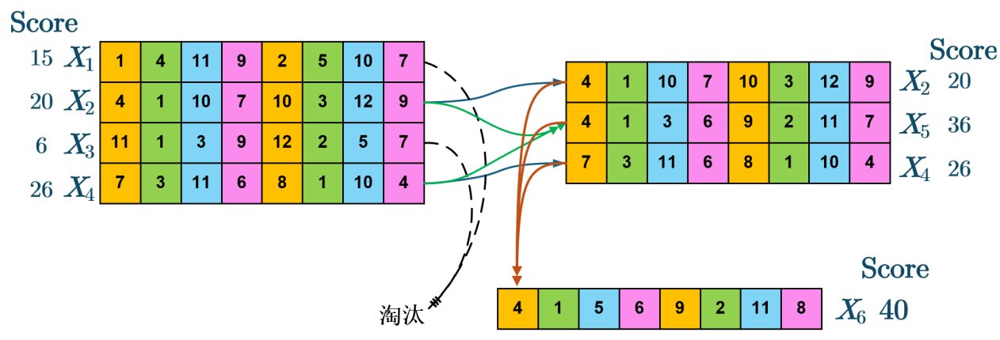

# 2022A

### Problem 1

建立坐标系：建立地面绝对坐标系，以整个装置静止时质心为原点，向上为正。在此基础上，以PTO系统之浮子中心建立相对坐标系，向上为正。  
定义振子相对于地面坐标系之位移为 $z_{1}$，浮子相对于地面坐标系之位移为 $z_{2}$，那么振子相对于浮子的位移为 $z_{1}-z_{2}$。以下除了 $f$外，所有角标为1的均表示振子，角标为2的均表示浮子。

考虑输入系统的各种力：
1. **波浪激励力 $f_{1}$**：$$f_{1}=f_{0}\cos\omega t\tag{1}$$
2. **附加惯性力**：本质上是增加一个虚拟质量，记为 $m_{e}$
3. **兴波阻尼力 $f_{2}$**：$$f_{2}=-C_{L}\dot{z}_{2}\tag{2}$$
4. **静水恢复力 $f_{3}$**：$$f_{3}=-\rho gAz_{2}\tag{3}$$ 其中 $\rho$ 是水密度， $A$是浮子有效横截面积.

对整体的动力学方程为：$$m_{1}\ddot{z}_{1}+(m_{2}+m_{e})\ddot{z}_{2}=f_{1}+f_{2}+f_{3}\tag{4}$$

考虑振子的动力学方程：$$m_{1}\ddot{z}_{1}=-K(z_{1}-z_{2})-C(\dot{z}_{1}-\dot{z}_{2})\tag{5}$$

直接使用Kutta-Runge求解，步长设定为 $h=0.001$ 即可得到符合精度的结果  
小问2要求阻尼非线性，方程 $(5)$ 变为 $$m_{1}\ddot{z}_{1}=-K(z_{1}-z_{2})-C\sqrt{|\dot{z}_{1}-\dot{z}_{2}|}(\dot{z}_{1}-\dot{z}_{2})\tag{6}$$ 

### Problem 2

目标函数为：$$J=\arg \max_{C\in(0,100000)\atop\alpha\in(0,1)}\int_{t_{0}}^{t_{0}+T}C|\dot{z}_{1}(t)-\dot{z}_{2}(t)|^{2+\alpha}\mathrm{d}t\tag{7}$$ 对其进行解析求解有难度，进行数值估计：$$J=\arg \max_{C\in(0,100000)\atop\alpha\in(0,1)}\sum_{t=t_{0}}^{t_{0}+T}C|\dot{z}_{1}(t)-\dot{z}_{2}(t)|^{2+\alpha}\Delta t\tag{8}$$ 进而得到 $$\bar{P}=\frac{1}{T}\sum_{i=0}^{T/\Delta t}C|\dot{z}_{1}(i)-\dot{z}_{2}(i)|^{2+\alpha}\Delta t\tag{9}$$  使用遗传算法进行优化，设定 $t\in (\frac{100\pi}{\omega},\frac{200\pi}{\omega})$ ，这样可以确保处于相对稳定的阻尼振动状态。

*时间复杂度并不低，跑一次大概10min过去了。关于准确结果，优秀论文莫衷一是，对比三篇，本方案的误差控制在0.1%内。

**关于遗传算法的一个简单的图示：

### Problem 3
这部分运动只是增加了一个自由度。事实上，可以选取上面谈到的中轴线坐标，以及一个从外部看来的俯仰角作为广义坐标进行微分方程求解。这两个通道是相互独立不耦合的。  

方程 $(1)\sim (5)$ 仍然成立，只需要添加关于力矩的式子  
波浪激励力矩： $$M_{1}=M_{0}\cos\omega t\tag{11}$$ 附加惯性力矩：本质上是一个转动惯量 $I_{e}$  
兴波阻尼力矩： $$M_{2}=-M_{C_{L}}\dot{\theta}_{2}\tag{12}$$ 静水回复力矩： $$M_{3}=-M_{3}\theta_{2}\tag{13}$$
